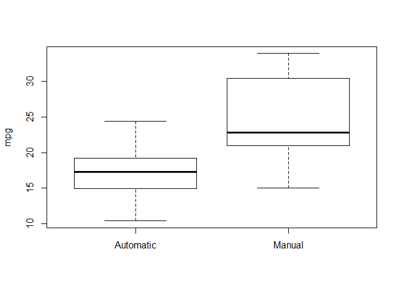
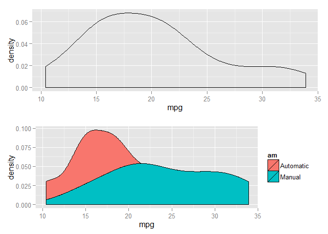
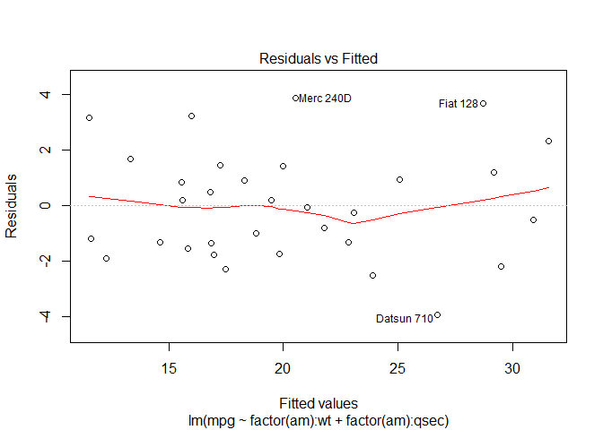
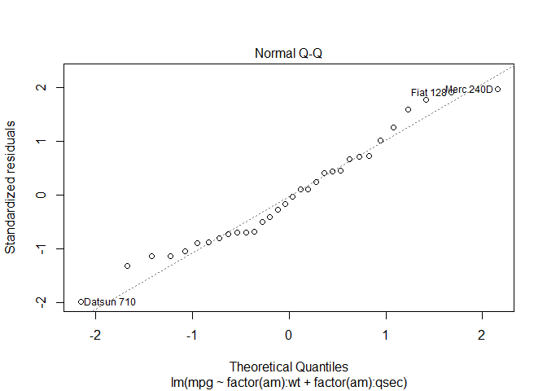
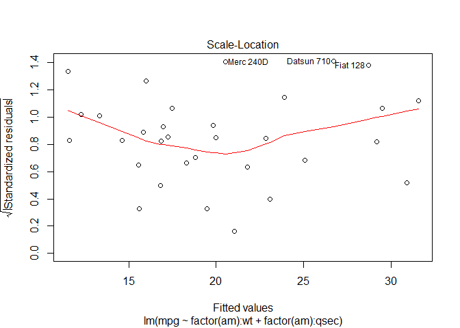
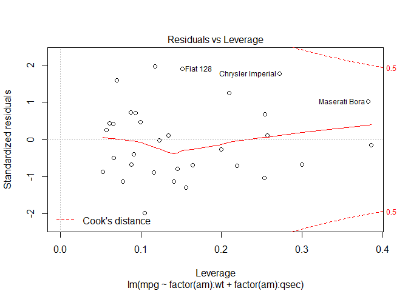

# Regression Models Course Project
apikou  
Friday, August 22, 2014  

# Summary:
- Looking at a data set of a collection of cars, WE are interested in exploring the relationship between a set of variables and miles per gallon (MPG) (outcome). We are particularly interested in the following two questions: Is an automatic or manual transmission better for MPG,and how to Quantify the MPG difference between automatic and manual transmissions ?
 
- Remarques:The data is about 32 cars from 1973-1974 , the study is 40 years old, the technolgy used in automatic transmission  has changed ,so any conclusion shoud relate to that period.Also the data has 32 observations which is low for a study of this magnitude .The mtcars subsetted by factor transmission table(am) shows 19 automatic and 13 manual , t.test would be applied , so all conclusion woud be with caution.            

- By ploting and testing the data (R mtcars dataset) ,we found that there is a significant difference (at  95%) between the mean MPG for manual and automatic cars (mean mpg for manual is 24.4 , and 17.17 for automatic).However by fitting multivariate models ,it appears that other importants factors in combination with the trans. type is the way to have a grasp on what affects the gas milage of a car.I started with a linear model accounting for all  variables,but due to colinearity among some and other fitting statistics i kept wt and hp with the conjonction the am factor.

# Data processing and exploration


```r
library(datasets)
str(mtcars)
```

```
## 'data.frame':	32 obs. of  11 variables:
##  $ mpg : num  21 21 22.8 21.4 18.7 18.1 14.3 24.4 22.8 19.2 ...
##  $ cyl : num  6 6 4 6 8 6 8 4 4 6 ...
##  $ disp: num  160 160 108 258 360 ...
##  $ hp  : num  110 110 93 110 175 105 245 62 95 123 ...
##  $ drat: num  3.9 3.9 3.85 3.08 3.15 2.76 3.21 3.69 3.92 3.92 ...
##  $ wt  : num  2.62 2.88 2.32 3.21 3.44 ...
##  $ qsec: num  16.5 17 18.6 19.4 17 ...
##  $ vs  : num  0 0 1 1 0 1 0 1 1 1 ...
##  $ am  : num  1 1 1 0 0 0 0 0 0 0 ...
##  $ gear: num  4 4 4 3 3 3 3 4 4 4 ...
##  $ carb: num  4 4 1 1 2 1 4 2 2 4 ...
```

- The mtcars dataset has 6 numeric variables and 5 categorical with 32 observations the outcome variable mpg is numeric ,the predictor am a categoricalwith 2 levels.   


- The plot (fig1) shows that the median mpg (thick line) for manual cars is above the median mpg for automatic cars,the averages are respectively 24.39 and 17.15, a difference of 7.24 mpg ,with regard to data is this significant ?

- Before we proceed to some testing and model fitting lets inspect the normality assumption of the  mpg distribution.


```r
mtcars$am <- factor(mtcars$am,levels = c(0,1), labels =c("Automatic","Manual"))
plot(mtcars$am,mtcars$mpg,ylab="mpg")
```

 

```r
aggregate(mpg~am,data=mtcars,mean)
```

```
##          am   mpg
## 1 Automatic 17.15
## 2    Manual 24.39
```

The mpg density seems to be likly normal (fig1) .

# t.test


```r
Amtcars <- mtcars[mtcars$am == "Automatic",]
Mmtcars <- mtcars[mtcars$am == "Manual",]
table(mtcars$am)
```

```
## 
## Automatic    Manual 
##        19        13
```

```r
t.test(Amtcars$mpg,Mmtcars$mpg)
```

```
## 
## 	Welch Two Sample t-test
## 
## data:  Amtcars$mpg and Mmtcars$mpg
## t = -3.767, df = 18.33, p-value = 0.001374
## alternative hypothesis: true difference in means is not equal to 0
## 95 percent confidence interval:
##  -11.28  -3.21
## sample estimates:
## mean of x mean of y 
##     17.15     24.39
```

- The t.test shows a p-value = 0.01374 which means a rejection of the null hypothesis ,so there is a significant mean mpg diffrence in favor of manual cars. However other factors could  have influeced this result?

# Correlation


```r
cor(mtcars$mpg,mtcars[,-9])
```

```
##      mpg     cyl    disp      hp   drat      wt   qsec    vs   gear
## [1,]   1 -0.8522 -0.8476 -0.7762 0.6812 -0.8677 0.4187 0.664 0.4803
##         carb
## [1,] -0.5509
```


- The correlation shows that wt,cyl,disp and hp are highly correlated to the outcome mpg , and should be added to am ,some of these eventual predictors are  correlated ,horse power(hp) means a bigger engine (cyl) and may define disp.  

# Regression Model (all variables)


```r
fit <- lm(mpg ~ factor(am)*., data = mtcars)
summary(fit)
```

```
## 
## Call:
## lm(formula = mpg ~ factor(am) * ., data = mtcars)
## 
## Residuals:
##    Min     1Q Median     3Q    Max 
## -2.035 -0.760  0.109  0.548  2.696 
## 
## Coefficients: (2 not defined because of singularities)
##                            Estimate Std. Error t value Pr(>|t|)  
## (Intercept)                  8.6435    22.3728    0.39    0.706  
## factor(am)Manual          -146.5509    66.3235   -2.21    0.047 *
## cyl                         -0.5339     1.1726   -0.46    0.657  
## disp                        -0.0203     0.0181   -1.12    0.286  
## hp                           0.0622     0.0479    1.30    0.218  
## drat                         0.5916     3.1326    0.19    0.853  
## wt                           1.9541     2.3207    0.84    0.416  
## qsec                        -0.8843     0.7888   -1.12    0.284  
## vs                           0.7389     2.6125    0.28    0.782  
## amManual                         NA         NA      NA       NA  
## gear                         8.6542     4.0517    2.14    0.054 .
## carb                        -4.8105     1.9765   -2.43    0.032 *
## factor(am)Manual:cyl        -0.7474     4.2614   -0.18    0.864  
## factor(am)Manual:disp        0.2002     0.1596    1.25    0.234  
## factor(am)Manual:hp         -0.2227     0.1381   -1.61    0.133  
## factor(am)Manual:drat       -5.5414     5.8474   -0.95    0.362  
## factor(am)Manual:wt        -12.4960     5.0728   -2.46    0.030 *
## factor(am)Manual:qsec        8.9793     3.2147    2.79    0.016 *
## factor(am)Manual:vs          0.2042     5.2854    0.04    0.970  
## factor(am)Manual:amManual        NA         NA      NA       NA  
## factor(am)Manual:gear        3.6743     7.2513    0.51    0.622  
## factor(am)Manual:carb        9.4991     4.1683    2.28    0.042 *
## ---
## Signif. codes:  0 '***' 0.001 '**' 0.01 '*' 0.05 '.' 0.1 ' ' 1
## 
## Residual standard error: 1.88 on 12 degrees of freedom
## Multiple R-squared:  0.962,	Adjusted R-squared:  0.903 
## F-statistic: 16.2 on 19 and 12 DF,  p-value: 8.25e-06
```

- Model Evaluation : This all variable model do have a good R^2 (96% ) which means the model explains 96% of the total variability.But there are too many predictors some of them are correlated, the p values from the model summary shows that wt , carb and qsec coefficients are significatif.(fig) 

# Reduced model (stepwise selection)


```r
min.model <- lm(mpg ~ 1, data= mtcars)
fwd.model <- step(min.model, direction = "forward",
                  scope=(~factor(am) :(wt +qsec+carb )),trace=0)
summary(fwd.model)
```

```
## 
## Call:
## lm(formula = mpg ~ factor(am):wt + factor(am):qsec, data = mtcars)
## 
## Residuals:
##    Min     1Q Median     3Q    Max 
## -3.936 -1.402 -0.155  1.269  3.886 
## 
## Coefficients:
##                          Estimate Std. Error t value Pr(>|t|)    
## (Intercept)                13.969      5.776    2.42   0.0226 *  
## factor(am)Automatic:wt     -3.176      0.636   -4.99  3.1e-05 ***
## factor(am)Manual:wt        -6.099      0.969   -6.30  9.7e-07 ***
## factor(am)Automatic:qsec    0.834      0.260    3.20   0.0035 ** 
## factor(am)Manual:qsec       1.446      0.269    5.37  1.1e-05 ***
## ---
## Signif. codes:  0 '***' 0.001 '**' 0.01 '*' 0.05 '.' 0.1 ' ' 1
## 
## Residual standard error: 2.1 on 27 degrees of freedom
## Multiple R-squared:  0.895,	Adjusted R-squared:  0.879 
## F-statistic: 57.3 on 4 and 27 DF,  p-value: 8.42e-13
```

# Model Validation and Interpretation

 We wnat to verify the model s quality by running diagnostic checks by plotting the model object plot(fwd.model) (fig) .

- the points in the Residual vs fitted plot are randomly scattered with no particular pattern (fig)

- The points in the Normal Q-Q plot are more or less in the line indicating that the residuals follow a normal distribution fig()

- In the  residual vs Levrage and the Scale-Location the points are not too far from the center fig()

# Interpretation 

- R^2=0.89 this is a good number , it means that 89% of the total data variation is explained by the model.
- P valus are very low ,the model s coefficients are definetly not zeros.
- F = 8.42e-13 a very good fit.
-Coefficients (the slopes) :There are 4 coefficients to 4 interaction variables:
- coef = -3.176 : a negative effect on mpg , a 1000lbs variation of wt would decrease mpg by 3.176 miles/galon for manual cars .
- coef = -6.099 :a negative effect on mpg , a 1000lbs variation of wt would 
decrease mpg by 6.009 miles/galon for automatic cars .
- qsec have a positive effect on mpg for both kevels of am

# Appendix

- Fig2


```r
library(ggplot2)
library(gridExtra)
```

```
## Loading required package: grid
```

```r
par(mfrow=c(1,2))
p1=qplot(mpg, data = mtcars, geom ="density" )
p2=qplot(mpg, data = mtcars, geom ="density",fill = am )
grid.arrange(p1,p2)
```

 

- fig3


```r
plot(fwd.model)
```

    


